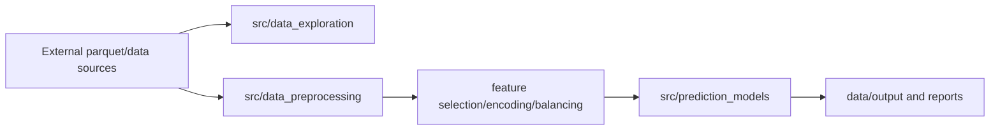

# Architecture

```mermaid
flowchart LR
  Data[External parquet/data sources] --> Explore[src/data_exploration]
  Data --> Prep[src/data_preprocessing]
  Prep --> Features[feature selection/encoding/balancing]
  Features --> Models[src/prediction_models]
  Models --> Outputs[data/output and reports]
```

Raw data and generated outputs are separate from the source pipeline.
